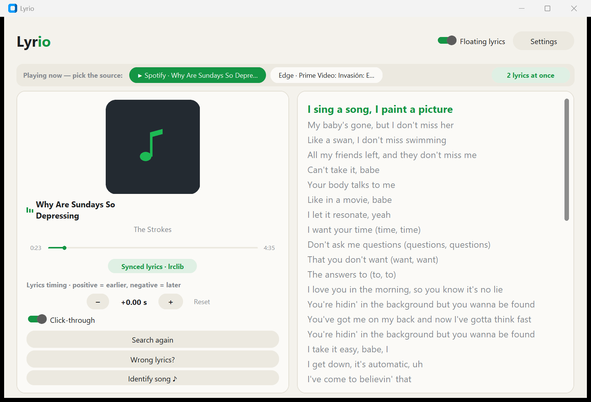

# Lyrio

Floating, synced lyrics for anything playing on your PC — Spotify, YouTube, or any player. Free to use. Made by **EazyHood**.

Letras flotantes y sincronizadas para lo que suene en tu PC — Spotify, YouTube o cualquier reproductor. Gratis. Hecho por **EazyHood**.


## What it does / Qué hace



- **Floating lyrics overlay** — transparent background, always on top, draggable, click-through ghost mode, word-by-word karaoke sweep, 4 style themes (Classic, Cartoon, Neon, Minimal), adjustable width, 1–3 visible lines, alignment, font and color.
- **Finds any lyric** — 8 sources searched in order and validated by artist + duration: lrclib, Musixmatch, QQ Music, Kugou, NetEase, letras.com, Genius, lyrics.ovh.
- **Song identification (Shazam-style)** — recognizes the actual song from the system audio, even when a video's title isn't the song name. Its offset also auto-syncs videos that have intros.
- **AI sync** — when no source has real timing, a local Whisper model listens to the song, transcribes the singer word by word and aligns the lyrics by itself. Fully offline, background, with a quality gate.
- **Audio calibration** — detects where the music really starts (spoken intros/skits) and re-anchors estimated lyrics; remembered per song.
- **Radio mode** — no player detected at all? Lyrio identifies what's playing by listening and drives the lyrics with Shazam's clock.
- **Click to jump** — click any line (or the progress bar) to seek there in the player. Per-song timing offset, persisted.
- **Sync by hand + community** — live-correction editor (press Space when the highlighted line starts; everything after shifts). Publish your sync to lrclib with your signature; synchronizer credits are shown at the end of songs.
- **Multi-source** — two players at once? Pick the source with one click, or show **2 lyrics at the same time** (dual overlay).
- English / Español · light & dark themes · system tray · global hotkeys (Ctrl+Alt+L, ←→ timing, ↑↓ size) · single instance · autostart.

## Install / Instalar

Download `Lyrio.exe` from [Releases](../../releases) and double-click it. No Python, no account, no login.

Descarga `Lyrio.exe` desde [Releases](../../releases) y doble clic. Sin Python, sin cuentas, sin login.

> Windows 10/11. Lyrio reads the media session that Windows exposes (SMTC) — it never touches the players themselves.

## Run from source / Ejecutar desde código

```bash
pip install requests customtkinter pystray pillow syncedlyrics pyaudiowpatch numpy shazamio==0.4.0.1 audioop-lts faster-whisper
python main.py
```

Build the exe with `build.bat` (PyInstaller).

## How the hard parts work / Cómo funcionan las partes difíciles

| Problem | Solution |
|---|---|
| Video title ≠ song name | Title cleanup (VEVO, `- Topic`, `[4K]`…) + duration-gated fuzzy search + Shazam-style audio identification |
| Song has no synced lyrics anywhere | Local Whisper transcribes the vocals and aligns the known text word by word (source: "AI-synced") |
| Song starts with a spoken intro | Loopback audio analysis finds the real music onset and re-anchors the timing |
| Bluetooth latency | Global offset setting; per-song offsets are persisted separately from the cache |
| Two apps playing at once | Source picker chips + optional dual overlay |

## Privacy / Privacidad

Everything runs locally. No account, no telemetry. Audio is captured only from your own system output, analyzed in memory/temp and discarded. Lyrics are fetched from public sources and cached locally (auto-pruned). Publishing to lrclib is manual and anonymous (only your chosen signature is embedded).

## License / Licencia

Free to use, attribution required. Not for sale, no illegal use. All rights reserved by **EazyHood** — see [LICENSE](LICENSE).

Gratis y libre de usar, con reconocimiento. Prohibida su venta y el mal uso. Todos los derechos reservados por **EazyHood** — ver [LICENSE](LICENSE).
